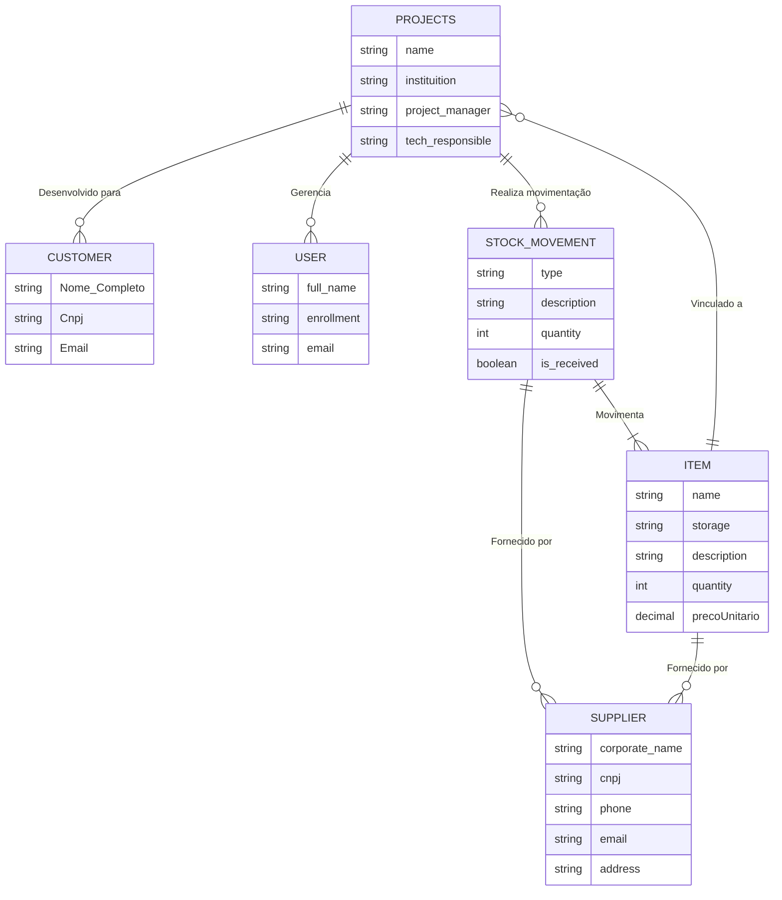

# 📦 Sistema de Gestão de Estoque

### Descrição

Este projeto foi desenvolvido como parte do curso de **Análise e Desenvolvimento de Sistemas (ADS)**, durante a **quarta fase** da faculdade. O objetivo principal é criar uma solução de gestão de estoque eficiente, permitindo o controle e monitoramento de produtos através de seu respectivo projeto.

## 🚀 Funcionalidades

- **Gerenciamento de Usuários (Funcionários):** Registrar, visualizar, deletar e editar todos os funcionários da empresa, permitindo a gestão de suas funções em cada projeto.
- **Projetos:** Criar e gerenciar projetos, vinculando funcionários e produtos, permitindo a organização e execução das tarefas de acordo com a necessidade de cada projeto.
- **Movimentação de Estoque:** Registrar entradas e saídas de produtos com suporte a upload de PDF/XML de notas fiscais para preenchimento automático.
- **Item:** Gerenciar os itens do estoque, com controle preciso de suas características como quantidade, localização e movimentações.
- **Cliente:** Registrar e gerenciar os dados dos clientes, facilitando o controle de pedidos e personalizações de acordo com suas demandas.
- **Fornecedor:** Cadastrar e gerenciar fornecedores, garantindo que todas as transações e aquisições sejam documentadas e rastreáveis.
- **Upload de Documentos:** Sistema integrado com AWS S3 para armazenamento de documentos (XMLs, PDFs).
- **Parser de Notas Fiscais:** Extração automática de dados de PDFs/XMLs de notas fiscais para preenchimento de formulários.

## 🛠️ Tecnologias Utilizadas

### Frontend
- **TypeScript** - Linguagem principal
- **Next.js 14** - Framework React com App Router
- **React Hook Form** - Gerenciamento de formulários
- **TanStack Query** - Estado de servidor e cache
- **Tailwind CSS** - Estilização
- **Shadcn/ui** - Componentes de UI
- **Axios** - Cliente HTTP

### Backend
- **Node.js** - Linguagem do backend


### Banco de Dados & Infraestrutura
- **MySQL** - Banco de dados principal
- **AWS S3** - Armazenamento de documentos
- **Docker** - Containerização

## 📋 Pré-requisitos

- **Node.js** (versão 18+)
- **Docker** e **Docker Compose**
- **MySQL** (ou usar via Docker)

## 🚀 Como executar o projeto

### 1. Clone o repositório

```bash
git clone https://github.com/seu-usuario/gestao-estoque-frontend.git
cd gestao-estoque-frontend/gestao-estoque-fe
```

### 2. Configuração das variáveis de ambiente

Crie um arquivo `.env` na raiz do projeto frontend:

```env
# API
NEXT_PUBLIC_API_URL=http://localhost:8080

# AWS S3
NEXT_PUBLIC_BUCKET=seu-bucket-s3
AWS_ACCESS_KEY_ID=sua-access-key
AWS_SECRET_ACCESS_KEY=sua-secret-key
AWS_REGION=us-east-1
```

### 3. Instalar dependências

```bash
npm install
# ou
yarn install
```

### 4. Executar com Docker (Recomendado)

```bash
# Subir todos os serviços (frontend, backend, banco)
docker-compose up -d

# Verificar logs
docker-compose logs -f
```

### 5. Executar localmente (Desenvolvimento)

```bash
# Frontend
npm run dev

# O frontend estará disponível em http://localhost:3000
```

### 6. Configuração do Banco de Dados

Se estiver usando Docker, o banco será criado automaticamente. Caso contrário:

```sql
CREATE DATABASE gestao_estoque;
-- Execute as migrations necessárias
```

## 📡 Rotas da API

### Frontend Routes
- `/` - Dashboard principal (redireciona para `/projetos`)
- `/projetos` - Listagem de projetos
- `/projetos/novo` - Criar novo projeto
- `/funcionarios` - Gerenciamento de funcionários
- `/clientes` - Gerenciamento de clientes
- `/fornecedores` - Gerenciamento de fornecedores
- `/itens` - Gerenciamento de itens do estoque
- `/itens/novo` - Cadastro de novos itens (com upload de XML/PDF)
- `/movimentacao` - Movimentação de estoque (entrada/saída)

### Backend API Endpoints

#### Autenticação
- `POST /api/auth/login` - Login de usuário
- `POST /api/auth/logout` - Logout de usuário

#### Usuários/Funcionários
- `GET /api/users` - Listar funcionários
- `POST /api/users` - Criar funcionário
- `PUT /api/users/:id` - Atualizar funcionário
- `DELETE /api/users/:id` - Deletar funcionário

#### Projetos
- `GET /api/projects` - Listar projetos
- `POST /api/projects` - Criar projeto
- `PUT /api/projects/:id` - Atualizar projeto
- `DELETE /api/projects/:id` - Deletar projeto

#### Itens
- `GET /api/items` - Listar itens
- `POST /api/items` - Criar item
- `PUT /api/items/:id` - Atualizar item
- `DELETE /api/items/:id` - Deletar item

#### Fornecedores
- `GET /api/suppliers` - Listar fornecedores
- `POST /api/suppliers` - Criar fornecedor
- `PUT /api/suppliers/:id` - Atualizar fornecedor
- `DELETE /api/suppliers/:id` - Deletar fornecedor

#### Clientes
- `GET /api/customers` - Listar clientes
- `POST /api/customers` - Criar cliente
- `PUT /api/customers/:id` - Atualizar cliente
- `DELETE /api/customers/:id` - Deletar cliente

#### Movimentação de Estoque
- `GET /api/estoque` - Listar movimentações
- `POST /api/estoque` - Criar movimentação
- `PUT /api/estoque/:id` - Atualizar movimentação
- `DELETE /api/estoque/:id` - Deletar movimentação

#### Uploads e Parsing
- `POST /api/aws/s3` - Upload de arquivos para S3
- `POST /api/parser/pdf` - Parse de PDFs de notas fiscais
- `POST /api/parser/xml` - Parse de XMLs de notas fiscais

## 🎯 Funcionalidades Especiais

### Upload e Parse de Notas Fiscais
O sistema permite:
1. **Upload de XML** - Extração automática de produtos da NFe
3. **Preenchimento automático** - Os campos do formulário são preenchidos automaticamente

### Gestão de Documentos
- Armazenamento seguro no AWS S3
- Versionamento de documentos
- Controle de acesso por projeto

### Sistema de Movimentação
- Entrada e saída de produtos
- Histórico completo de movimentações
- Integração com notas fiscais

## 📊 Diagrama Entidades do Sistema



## 🤝 Colaboradores

<div align="center">

| [João Salvador](https://github.com/Ssalvador221) | [Matias Gonzalvez](https://github.com/matiasgonzalvez) | [Jael Felipe](https://github.com/JFP79) | [Felipe Loche](https://github.com/felipeloche) |
|:---:|:---:|:---:|:---:|
|  |  |  |  |

</div>

## 🔧 Troubleshooting

### Problemas comuns:

1. **Erro de conexão com banco:**
   ```bash
   # Verifique se o MySQL está rodando
   docker-compose ps
   ```

2. **Erro de upload para S3:**
   - Verifique as credenciais AWS no `.env.local`
   - Confirme as permissões do bucket

### Comandos úteis:

```bash
# Resetar containers
docker-compose down -v && docker-compose up -d

# Ver logs específicos
docker-compose logs -f frontend
docker-compose logs -f backend

# Executar migrations
docker-compose exec backend go run migrate.go
```

## 📞 Suporte

Para dúvidas ou problemas, abra uma issue no repositório ou entre em contato com a equipe de desenvolvimento.

---

<div align="center">
  <p>Desenvolvido com ❤️ pela equipe ADS - 5ª 
